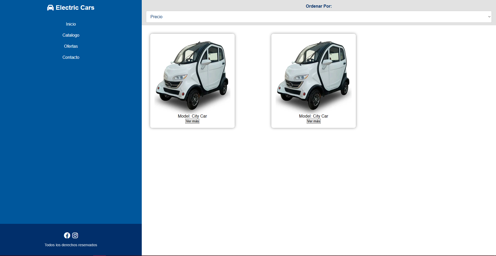
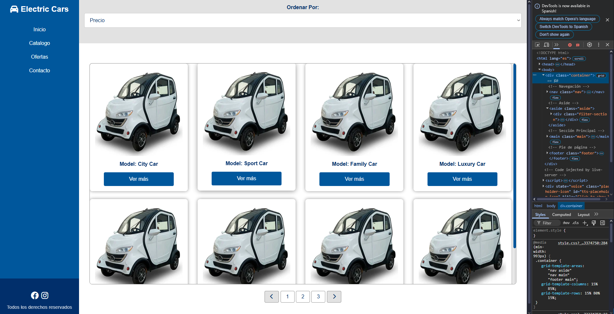
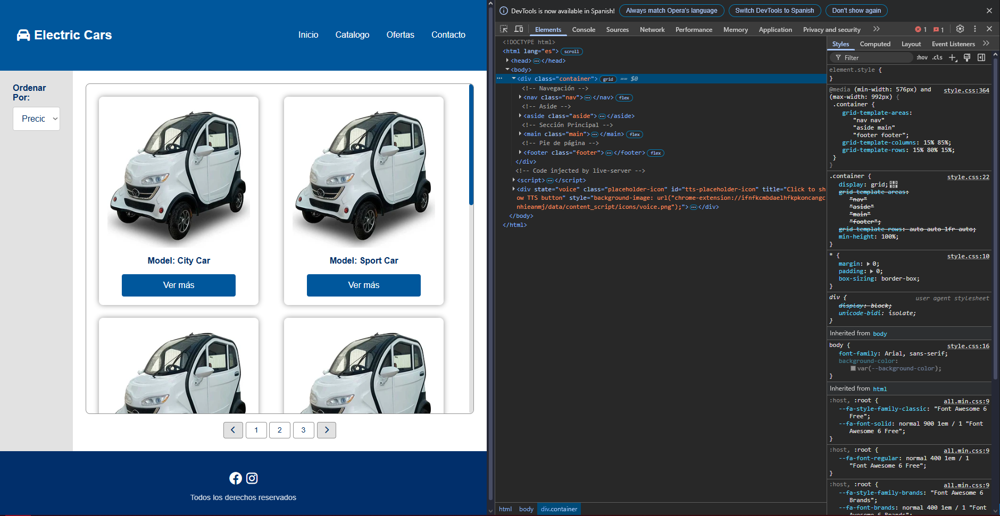
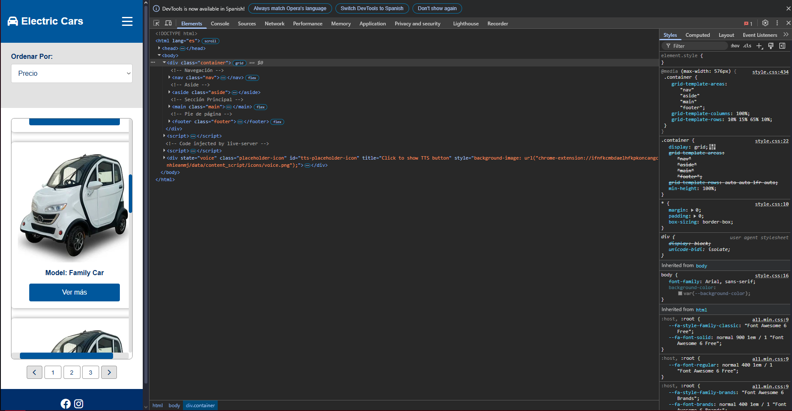

# 📈 Progreso del Desarrollo - Electric Car Store

## 🚀 Evolución del Proyecto

Este documento muestra el progreso visual del desarrollo del proyecto **Electric Car Store** a través de capturas de pantalla de cada commit importante.

---

## 📸 Capturas de Progreso

### Commit 1 - Inicio del Proyecto

*Estructura inicial del proyecto y configuración base*

---

### Commit 2 - Desarrollo de Layout

*Implementación del layout principal y grid básico*

---

### Commit 3 - Responsive Design

*Adaptación responsive para diferentes breakpoints*

---

### Commit 4 - Estilos y Componentes

*Refinamiento de estilos y componentes visuales*

---

### Commit 5 - Funcionalidad JavaScript

*Implementación de interactividad y menú hamburguesa*

---

### Commit 6 - Versión Final

*Proyecto completado con todos los requerimientos cumplidos*

---

## 📊 Resumen del Desarrollo

| Fase | Descripción | Estado |
|------|-------------|--------|
| **Commit 1** | Configuración inicial y estructura HTML | ✅ |
| **Commit 2** | Layout principal con CSS Grid | ✅ |
| **Commit 3** | Media queries y responsive design | ✅ |
| **Commit 4** | Estilos avanzados y componentes | ✅ |
| **Commit 5** | JavaScript y funcionalidad interactiva | ✅ |
| **Commit 6** | Optimización final y documentación | ✅ |

---

## 🎯 Logros Conseguidos

- ✅ **Layouts Responsivos**: 3 breakpoints (Mobile, Tablet, Desktop)
- ✅ **CSS Grid**: Implementado con grid-template-areas
- ✅ **Flexbox**: Distribución flexible en todas las secciones
- ✅ **JavaScript**: Menú hamburguesa funcional
- ✅ **Documentación**: README completo y detallado

---

**Desarrollado por**: Julian Aguirre  
**Curso**: CSS Avanzado - Desafío Latam  
**Desafío**: 3 - Electric Car Store  
**Fecha**: 2025
